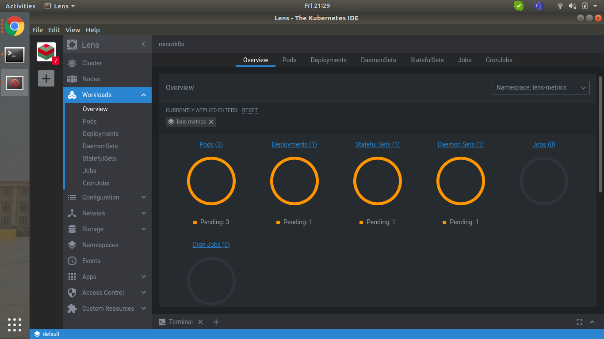

# On-Premise Deployment

## Project Dscription:

This project aims to solve on-premise application deployment. This is demonstrated by deploying parse-server on kubernetes. 
The entire project focueses on resolving issues including Ease of clustered enterprise level deployments,Incremental remotely triggered application updates,Easy remote debugging, Health Alerts and Monitoring, Application Security (with source code protection) and Disaster management.

GitHub repo link: https://github.com/gade-raghav/Atlantask

## Installation and Usage Instructions

Tools/Softwares/Services used:

- Kuberntes using Microk8s

- Lens (IDE for Kubernetes) 

- Helm/Helm Charts

- Parse Server

- Prometheus 

- Grafana

- Weavely Cloud

- GitHub

### Pre-requisites

**Note**:I am solving this problem on my local machine as I do not have access to any Cloud services.

Operating System : Ubuntu 18.04 LTE

### Steps

#### Kubernetes Setup using [microk8s](https://microk8s.io/docs):
Initially we need to setup Kubernetes :

Install microk8s :

`sudo snap install microk8s --classic`

`sudo usermod -a -G microk8s $USER`

`sudo chown -f -R $USER ~/.kube`

This will give us Kubectl command line tool and kube config file.

Add an alias in .bashrc as follows to make things simpler:

`alias kubectl="microk8s.kubectl"`

Run `source .bashrc` after making changes to .bashrc file.

Incase config file doesn't exist in ~/.kube directory follow the steps below

`
microk8s config > ~/.kube/config
`

Extra careful while giving read,write and execute permissions 

`chmod 700 ~/.kube/config`

Now let's run kubernetes cluster

`microk8s start`

Check status using the following commands and make sure everything is running.

`kubectl get nodes` (Check if node is ready. We are using a single node.)

`kubectl get all --all-namespaces`

#### [Lens](https://k8slens.dev/) Setup:

Lens is and IDE for working Kubernetes clusters. You just need to pass in the kube config file and it takes care of the rest.

[Installing Lens](https://github.com/lensapp/lens/releases/tag/v3.6.7)

I have downloaded the AppImage which is extremely easy to use. After download give executable permissions to file and run using the following command

`./Lens-3.6.6.AppImage`

Provide path to kubernetes config file and it gets all the information about the cluster.

#### [Helm](https://helm.sh/) Setup:

Helm is the Package Manager for Kubernetes.Helm is the best way to find, share, and use software built for Kubernetes.

[Installing helm](https://helm.sh/docs/intro/install/)

I prefer installing it from script.

Helm now has an installer script that will automatically grab the latest version of Helm and install it locally.

Run the following commands:

`curl -fsSL -o get_helm.sh https://raw.githubusercontent.com/helm/helm/master/scripts/get-helm-3`

`chmod 700 get_helm.sh`

`./get_helm.sh`

#### [Parse Server](https://github.com/parse-community/parse-server) Setup:

Parse Server is an open source backend that can be deployed to any infrastructure that can run Node.js.

We are going to setup parse server using  helm charts. [Artifact Hub](https://artifacthub.io/) has a lot of kubernetes package.
Search for the required package and it provides us with clear instructions about how to use it. We can also do it using command line as follows.

Repo used for pulling parse chart : Bitnami

Bitnami makes it easy to get your favorite open source software up and running on any platform, including your laptop, Kubernetes and all the major clouds.

Pull Bitnami repo

`helm repo add bitnami https://charts.bitnami.com/bitnami`

Search for for the parse package

`helm search repo parse`

We will use bitnami/parse which is stable

Let's inspect the values of bitnami/parse chart

`helm inspect values bitnami/parse >> ~/atlanwork/parse.values`

We need to change the service type from LoadBalance to NodePort as we are running it in local environment.Make the following changes (type: NodePort)

Create a namespace which helps monitoring easy

`kubectl create namespace parse`

**Deploying parse server using helm chart**

name: parse-server 

namespace: parse

`helm install parse-server bitname/parse --values parse.values -n parse`

Wait for sometime until the parse-server is deployed. Check the status on Lens which is user-friendly.

Now we need to follow the instructions provided by bitnami chart i.e to get the port numbers from services deployed.

Run the following commands

Finally make curl request 

`
curl -X POST \
-H "X-Parse-Application-Id: APPLICATION_ID" \
-H "Content-Type: application/json" \
-d '{"score":1337,"playerName":"Sean Plott","cheatMode":false}' \
http://$SERVICE_HOST/parse/classes/GameScore
`

You should get a response similar to this:

`
{
  "objectId": "2ntvSpRGIK",
  "createdAt": "2016-03-11T23:51:48.050Z"
}
`

#### [Prometheus](https://prometheus.io/) Setup :

Prometheus is an open-source systems monitoring and alerting toolkit originally built at SoundCloud.

Now things get a little interesting. We can setup Prometheus from scratch using helm just like we setup parse-server. However, since 
we installed Lens we can just do it with a click!

Background workflow when we click *install*

- lens-metrics namespace is created
- helm is used to setup prometheus from stable/prometheus helm-chart with metrics enabled (this saves a lot of time metrics are autoamatically enabled which is a huge bonus)

Check the status of lens-metrics namespace and then we can access prometheus from the pod just by a click.

#### [Grafana](https://grafana.com/) Setup:

Grafana has become the world’s most popular technology used to compose observability dashboards with everything from Prometheus & Graphite metrics, to logs and application data to power plants and beehives

We will be using this amazing tool to  query, visualize, alert on, and explore your metrics no matter where they are stored.
In plain English, it provides you with tools to turn your time-series database (TSDB) data into beautiful graphs and visualizations.

We will setup grafana using helm charts as well

Search for for the grafana package

`helm search repo grafana`

We will use bitnami/grafana which is stable

Let's inspect the values of bitnami/grafana chart

`helm inspect values bitnami/grafana >> ~/atlanwork/grafana.values`

We need to change the service type from LoadBalance to NodePort as we are running it in local environment.Make the following changes (nodePort: --your-choice(between 30000-32767) type: NodePort)

Create a namespace which helps monitoring easy

`kubectl create namespace grafana`

**Deploying grafana using helm chart**

name: grafana

namespace: grafana

`helm install grafana bitname/grafana --values grafana.values -n grafana`

Wait for sometime until the grafana is deployed. Check the status on Lens which is user-friendly.

Now we need to follow the instructions provided by bitnami chart i.e to get the port numbers from services deployed.

Run the following commands

#### [Weavely](https://www.weave.works/product/cloud/) Setup:

Weave Cloud is an automation and management platform for development and DevOps teams.

**NOTE**: We will take a free-trail account to demonstrate the use case.

Login to weave cloud and add a cluster

We have to select
- platform: Kubernetes(in our case)
- environment: Generic Kubernetes(in our case)
- install using helm 

***Prior to helm installation, create a namespace "weave" in kubernetes as it is a pre-requisite.***

Now we can add our github repo for setting up CI/CD pipeline.Go to settings>configure and add our github repo url.

Weavely offers prometheus and grafana monitoring as well, however we already have a reliable local setup.

Installation and Setup is complete.

## Use Cases and Edge Conditions

- The entire deployment has been done using local setup and the same can be replicated on cloud environment if given access.

- Cluster is managed by nodeports and not loadbalancer as we are not usin any cloud services.

- Helm charts used for deployment has minimum required parameters enabled, however they can be changed using values.yaml file as per requirement.

- Since helm charts are used for deployment, they are very reliable and hence requires minimal edit to charts. So every commit coming from the remote git source repo is already code analysed.

## Workflow

We'll pick up the issues mentioned in the problem statements and elaborate the workflow with images as well.

#### Ease of clustered enterprise level deployments

On cloud kubernetes clusters can be created using terraform given access. I have experience in creating kuberenetes cluster using terraform incase access is provided.
As far as application deployment is concerned, helm charts themselves can be installed on clustered kubernetes, however deployment configuration like helmsman and fluxcd can be used. Fluxcd supports GitOps model wherein it would automatically update as soon as new code is pushed.
The git repository forementioned has the charts and templates which are used for application deployment in our case.

#### Incremental remotely triggered application updates

Weave cloud has been used to resolve this issue however configuration files have a huge role to play in triggering updates.
When we setup weave cloud, we passed in our github repo link. Every push to the repository will trigger a build and it will be deployed to kubernetes cluseter.

####  Remote Debugging 

Application logs can be pushed to a central entity like splunk. Metrics can be pushed to prometheus,signaleFX. Kubernetes supports demon fetchnk,prometheus and signalFX using which respective values of all pods on all nodes can be collected and pushed.
In our case we have used Lens for the same.

#### Health alerts and monitoring

Prometheus, Grafana and Weavely cloud has been collectively used to achieve health alerts and monitoring.
We have used Lens IDE which makes it extremely easy to setup prometheus.
Grafana has been setup from scratch usin helm charts.
Weavely cloud also sets up prometheus and monitors all the metrics.

Prometheus provides various metrics for data visualization.It is passed as data source for grafana.

We can enable various dashboards for monitoring various metrics provided by prometheus.We have enabled a particular dashboard and the following are the representations.

Weave cloud offers fine monitoring systemm as well. It also sends an email for every alert which has been demonstrated by a demo alert email.

  
#### Application Security

We need to check node security and make sure un-necessary softwares are not installed on the nodes.To achieve this we can us CORE OS if our target is to just deploy a docker container.
On cloud , we can use RBAC across all kubernetes componenets.For example, on AWS if a pod needs access to S3 bucket , it can be achieved by a service account with role based policy.This gives permission to the specified pod no matter on what node it runs within the cluster.
It helps in achieving fine grained access control.
External components like Lens can also be secured with roles.
Inter pod communication can be secured with mutual tls using istio.

#### Disaster Management

Velero an open source project integrates with kubernetes cluster and data storage to provide backup and restore of native kuberntes objects.The advantage with velero it backups up kubernets objects from etcd database.

## Data formats and Reporting

We receive the following metrics from prometheus and grafana.(All the metrics have not been mentioned as there was very minimal use case)

**Prometheus**

  - CPU Usage,Requests,Capacity and Linits
  - Memory Usage,Requests,Capacity and Linits
  - Pods Usage and Capacity
 
**Grafana**

  - CPU Usage
  - Memory Usage
  - All Processes networks I/O

## Performance and Scaling

Large Scaling is utilized when the traffic of workloads at hand is expanded  and here we have Lens for making it truly simple to perform scaling by only few clicks and edits.

The steps for scaling any component are as follows, however I will be emphasizing on Parse Server.

Go to Lens > Deployments and select parse-server.

Click on edit which will give you the deployment file.

Change replicas to required number (2 in our case) and then save it.

We can see the deployment progressing and pods scaling.

Depending upon our requirement, we can have the pods scaled.

## Unresolved Issues

Incremental remotely triggered updates and Disaster management issue has been theoretically resolved but is not practically tested by me. However I have tested scaling the application and in the same lines, edits can be made to helm charts an pushed to git repo which will trigger CI/CD pipeline. I need to dig a little deeper and then try and test it for production usage. Moreover, I have not figured out disaster management issue and hence the above mentioned tool velero is not tested in my project. 

